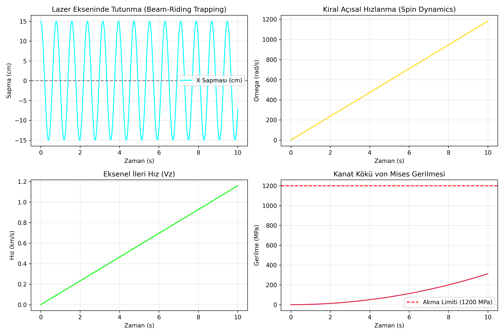

# VO-3 Chiralis: Chiral Photonic Sail Dynamics

[](https://doi.org/10.5281/zenodo.22939390)
[](https://opensource.org/licenses/MIT)

Numerical flight dynamics and optomechanical stability simulator for **VO-3 Chiralis**, a self-centering, relativistic directed-energy interstellar probe architecture.

## Overview
Planar lightsails (e.g., Breakthrough Starshot) encounter destabilizing beam-slip when pushed by high-intensity Gaussian laser arrays. VO-3 Chiralis employs a 3D helical chiral metasurface that:
1. Generates axial acceleration ($F_z$) via high-reflectance dielectric films ($R > 0.9998$).
2. Couples transverse radiation momentum into deterministic restoring torque ($\tau_z$), trapping the vehicle within the laser beam waist through passive gyroscopic rigidity.

## Mathematical Model
Based on the preprint:
> **Ziya Yeşilbahçe (2026).** *Chiral Photonic Sail Dynamics for Beam-Riding Stability and Gyroscopic Rigidity in Directed Energy Interstellar Probes.* Zenodo. [DOI: 10.5281/zenodo.22939390](https://doi.org/10.5281/zenodo.22939390)
## Simulation Results

## Quick Start
```bash
git clone [https://github.com/](https://github.com/)<kullanici-adin>/Vo3Chirals.git
cd vo3-chiralis-sim
pip install -r requirements.txt
python chiral_sail_sim.py
